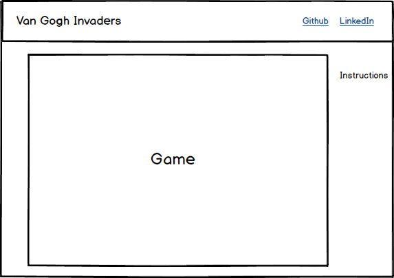

## Van Gogh Invaders

### Background

Van Gogh Invaders is basically Space Invaders meets Vincent Van Gogh.  
The background scenes will be his paintings.  Van Gogh will move around
and shoot paint brushes at the invaders.  The invaders will fire ears at him.  

### Functionality & MVP  

With this app, users will be able to:
- [] Move Vincent Van Gogh back and forth along the bottom of the screen using arrow keys
- [] Fire paint brushes at invaders
- [] Start, pause and reset the game
- [] The game will keep track of your score

### Wireframes

The app will be a single screen with a nav bar that has the title and links to
Github and LinkedIn.  In the game window will be buttons to pause, restart, and start
the game.  Brief instructions will be on the side.  There are basically 3 keys to move
and shoot.  

### Architecture and Technologies

### Implementation Timeline

### Bonus features
