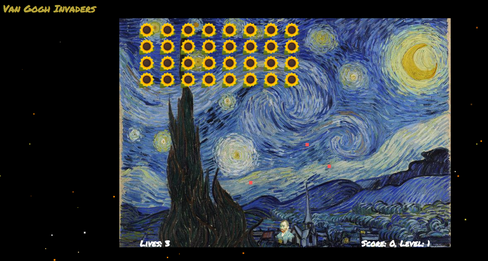
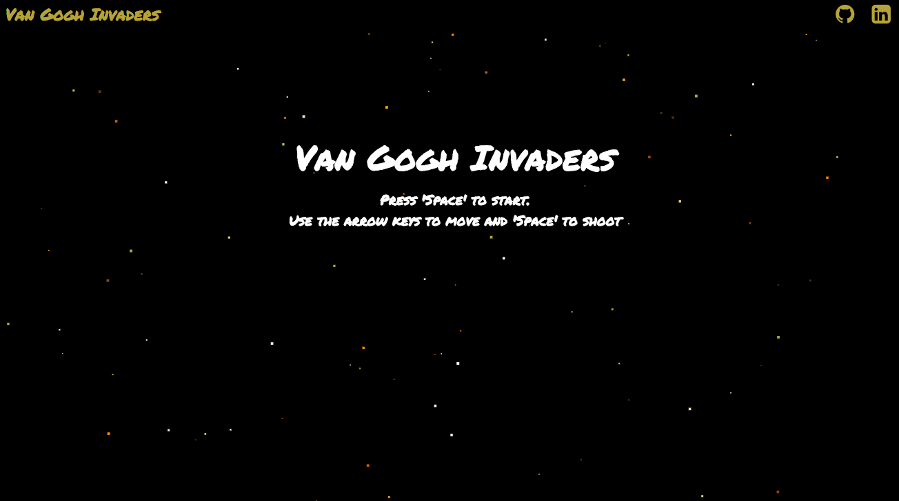

## Van Gogh Invaders

Van Gogh Invaders is Space Invaders meets Vincent Van Gogh.  

Evil sunflowers are invading the earth and it is up to Van Gogh to save the day.  
He utilizes his trusty paint brushes to take out the aliens, while dodging their bombs.  

The game is set against the background of his Starry Night.  

Use the arrow keys to navigate and the space bar to shoot.  Avoid the bombs, take out the invaders.  

### State  

The game employees for different states.  The initial background state,
a level screen, a game state, and the game over state.  Event listeners help
navigate through the various states, generally waiting for a space bar click.  
Although in the game state, it is left when lives equal zero or the aliens touch
Van Gogh.  

## Code

Stars twinkle by choosing colors at random whenever they re-render:

### Architecture and Technologies

This project will be implemented with the following technologies:

- Vanilla JavaScript for overall structure and game logic,
- `HTML5 Canvas` for DOM manipulation and rendering,
- setInterval for animation

### Implementation Timeline

**Day 1**:  Add the nav bar and layout start the background of the game

**Day 2**: Create the alien objects

**Day 3**: Create the shooting interactions

**Day 4**:  Cleanup and putting it all together

### Bonus features

- [ ] Build a few levels, maybe a bonus level where Van Gogh collects paint brushes
- [ ] Possibly create a few algorithm visualizations that mimic the starry night skies to add into the game.  
