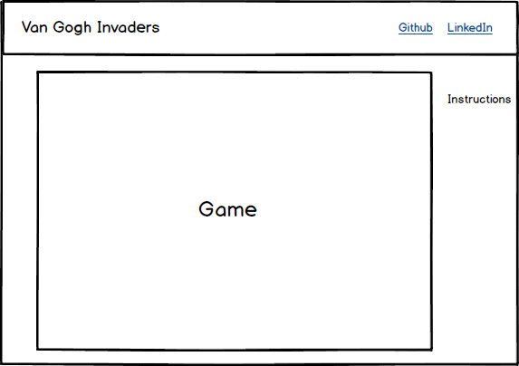

## Van Gogh Invaders

### Background

Van Gogh Invaders is basically Space Invaders meets Vincent Van Gogh.  
The background scenes will be his paintings.  Van Gogh will move around
and shoot paint brushes at the invaders.  The invaders will fire ears at him.  

### Functionality & MVP  

With this app, users will be able to:
- [ ] Move Vincent Van Gogh back and forth along the bottom of the screen using arrow keys
- [ ] Fire paint brushes at invaders
- [ ] Start, pause and reset the game
- [ ] The game will keep track of your score

### Wireframes

The app will be a single screen with a nav bar that has the title and links to
Github and LinkedIn.  In the game window will be buttons to pause, restart, and start
the game.  Brief instructions will be on the side.  There are basically 3 keys to move
and shoot.  

### Architecture and Technologies

This project will be implemented with the following technologies:

- Vanilla JavaScript for overall structure and game logic,
- `HTML5 Canvas` for DOM manipulation and rendering,
- Webpack to bundle and serve up the various scripts.

In addition to the webpack entry file, there will be five scripts involved in this project:

`game.js`: The main game file and game logic
`aliens.js`: Will render the various invading aliens
`paintbrush.js`: Shooting paintbrushes
`vangogh.js`: Our hero

### Implementation Timeline

**Day 1**:  Add the nav bar and layout start the background of the game

**Day 2**: Create the alien objects

**Day 3**: Create the shooting interactions

**Day 4**:  Cleanup and putting it all together

### Bonus features

- [ ] Build a few levels, maybe a bonus level where Van Gogh collects paint brushes 
- [ ] Possibly create a few algorithm visualizations that mimic the starry night skies to add into the game.  
